<h1 align="center">Hideaki Mizoue</h1>

<h3 align="center">Medical AI | Deep Learning | Genomics</h3>

  Medical student at <strong>Kansai Medical University</strong> working on AI for medicine.

## Highlights

- 🧬 Developer of **EvoSeq**
- 🧠 Building AI systems for medicine, imaging, and genomics
- ⚙️ Interested in deep learning, optimization, and practical medical applications

## Featured Repository

### 🧬 EvoSeq

**Deep Learning × Genomics × Medical AI**

  

  Deep learning and genomics project for medical AI applications.

  <a href="https://github.com/mizomizo1/EvoSeq">
    View Repository →
  </a>

## Tech

### Most used Languages

  

### AI / Data Science

  

### Web Development

  

### Backend / DevOps

  

### Creative / Documentation

  

